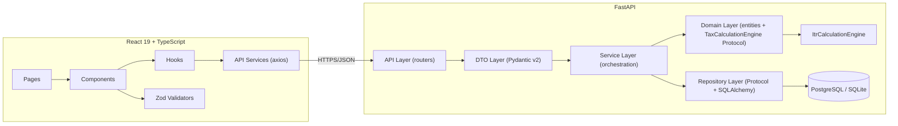
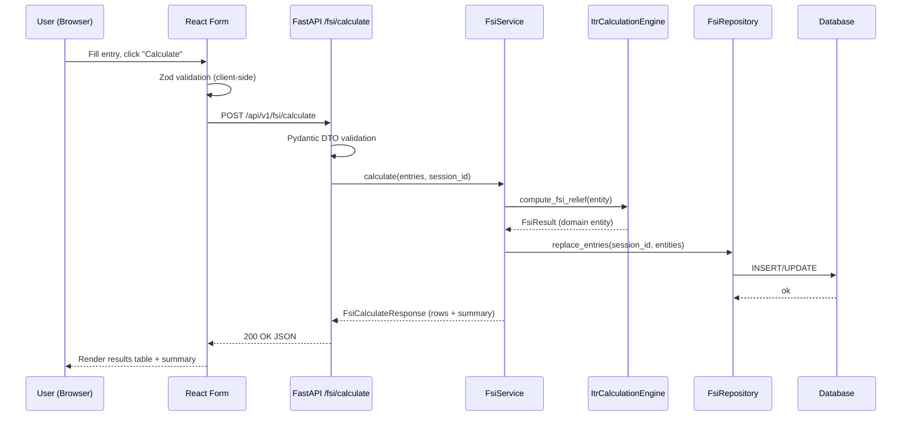

# Schedule Tax App

A full-stack web application that generates **Schedule FSI** (Foreign Source Income) and **Form A3**
(foreign tax credit / DTAA support schedule, driven by RSU/ESPP vest lots) data for Indian Income
Tax Return filing.

Built as a companion to the [`itr`](../itr) calculation scripts and the
[`sbi-fx-ratekeeper`](../sbi-fx-ratekeeper) exchange-rate scraper in this workspace — the calculation
logic is reused/ported behind a stable interface rather than duplicated.

## Architecture



### Why a `TaxCalculationEngine` Protocol?

All tax-calculation math (DTAA relief, currency conversion, peak/closing balance derivation) is
defined behind `app.domain.engine.interface.TaxCalculationEngine`, a `typing.Protocol`. The concrete
`ItrCalculationEngine` implementation ports the logic from the existing `itr/src` scripts. This means:

- Business rules are 100% framework-agnostic (no FastAPI/SQLAlchemy imports in `domain/`).
- The engine can be swapped (e.g. a future `RulesEngineV2`) without touching services, repositories,
  or the API layer — consumers only depend on the Protocol.
- The engine is trivially unit-testable in isolation (see `tests/unit/test_engine.py`).

### Sequence: calculating and persisting Schedule FSI



## Project layout

```
schedule-tax-app/
├── backend/                 # FastAPI service
│   ├── src/app/
│   │   ├── api/              # Routers + dependency wiring
│   │   ├── dto/               # Pydantic v2 request/response models
│   │   ├── services/          # Orchestration, no business logic
│   │   ├── domain/            # Entities + TaxCalculationEngine Protocol + ITR adapter
│   │   ├── repositories/      # Protocol interfaces + SQLAlchemy implementations
│   │   ├── persistence/       # SQLAlchemy models + async engine/session
│   │   └── core/              # config, logging, security, middleware, exceptions
│   ├── alembic/                # Migrations
│   └── tests/                  # unit / integration / api
└── frontend/                 # React 19 + TypeScript SPA
    └── src/
        ├── pages/             # Route-level screens
        ├── components/        # forms/, tables/, layout/, shared/
        ├── hooks/              # TanStack Query hooks
        ├── services/           # Axios API clients
        ├── validators/         # Zod schemas mirroring backend validation
        └── types/              # TS types mirroring backend DTOs
```

## Getting started

### Backend

```bash
cd schedule-tax-app/backend
uv venv --python 3.13
source .venv/bin/activate
uv pip install -e ".[dev]"
cp .env.example .env
alembic upgrade head
uvicorn app.main:app --reload --app-dir src
```

API docs: http://localhost:8000/api/docs

Run tests:

```bash
pytest -q --cov=app --cov-report=term-missing
```

### Frontend

```bash
cd schedule-tax-app/frontend
npm install
npm run dev
```

App: http://localhost:5173 (proxies `/api` to `http://localhost:8000`)

Run tests / build:

```bash
npm test
npm run build
```

### Docker Compose (full stack + Postgres)

```bash
cd schedule-tax-app
cp .env.example .env   # set real secrets before any non-local use
docker compose up --build
```

- Frontend: http://localhost:8080
- Backend: http://localhost:8000/api/docs
- Postgres: localhost:5432

## API surface

| Method | Path                        | Purpose                                   |
| ------ | --------------------------- | ------------------------------------------ |
| POST   | `/api/v1/fsi/calculate`     | Validate + calculate Schedule FSI entries  |
| POST   | `/api/v1/a3/calculate`      | Validate + calculate Form A3 entries (manual/advanced) |
| POST   | `/api/v1/a3/calculate-from-lots` | Aggregate RSU/ESPP vest lots (date/cost/quantity) into Form A3 rows, auto-fetching FX rates + stock prices |
| GET    | `/api/v1/dashboard/{id}`    | Aggregated dashboard metrics for a session |
| GET    | `/api/v1/export/csv`        | Export one schedule as CSV                 |
| GET    | `/api/v1/export/pdf`        | Export full multi-schedule PDF report      |
| POST   | `/api/v1/session/save`      | Persist/rename a filing session            |
| GET    | `/api/v1/session/{id}`      | Fetch a session with all entries           |
| GET    | `/api/v1/session`           | List sessions (paginated)                  |
| DELETE | `/api/v1/session/{id}`      | Delete a session and its entries           |

Full OpenAPI schema is served at `/api/docs` (Swagger UI) and `/api/openapi.json`.

## Security

- CSRF token issuance/verification (HMAC-based) for state-changing requests.
- Security headers middleware (`X-Content-Type-Options`, `X-Frame-Options`, CSP, etc.).
- Rate limiting via `slowapi` (30/min on calculate endpoints, 20/min on session save).
- Input sanitization (`core/security.sanitize_text`) to reduce stored-XSS risk on free-text fields.
- Structured logging (`structlog`) without leaking secrets; `.env` is git-ignored.
- Frontend CSP meta tag restricts `connect-src` to the API origin only.

## Known scope limitations / risks

This was built as a thorough vertical slice rather than the full multi-week enterprise scope implied
by the original spec. Called out here explicitly rather than left implicit:

- **Backend coverage is 86%**, short of the 90% target — a few edge-case branches in the export and
  market-data modules are untested.
- **Country/currency lists are curated (~30 entries)**, not exhaustive ISO 3166/4217 lists. Extending
  them only requires updating `dto/common.py` (backend) and `validators/schemas.ts` (frontend).
- **Market data provider (`YfinanceSbiMarketDataProvider`/`YfinanceStockPriceProvider`)** powers the
  lot-based Form A3 flow (`POST /api/v1/a3/calculate-from-lots`), which mirrors the existing `itr`
  repo's `generate_schedule_fa_a3.py`: enter RSU/ESPP vest lots (date, cost, quantity) and the FX
  rate + peak/closing stock price are fetched automatically. This requires
  `APP_MARKET_DATA_PROVIDER=yfinance_sbi`; with the default `manual` provider this endpoint returns a
  clear error.
- **No Form 67 / Schedule TR** support yet; the domain layer and repository pattern are structured so
  a new schedule type can be added by mirroring the FSI/A3 module structure.
- **Frontend bundle is a single ~750 kB chunk.** For production, add route-based `React.lazy()` code
  splitting.
- **No optimistic concurrency / soft-delete** on sessions; deleting a session hard-deletes its entries
  (cascades), which is simple but not reversible from the UI.
- **CI pipeline builds Docker images but does not push them** — wire up a registry + deployment step
  before using this in a real release pipeline.
